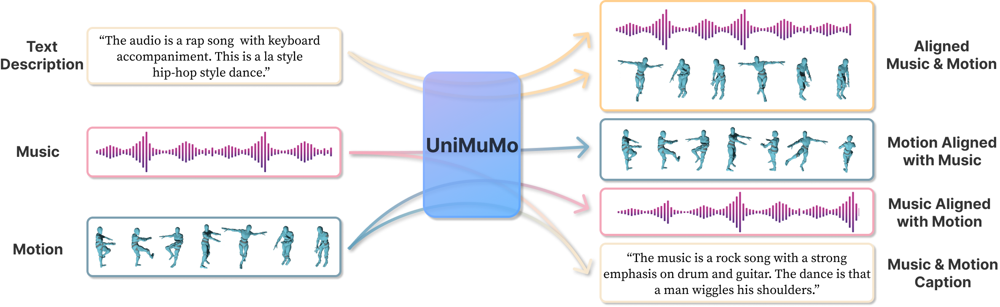

# To Run:
Ablation 2.2: run with initialized codebook
Ablation 7: train the model from scratch

# Running:
ablation 2.2

# Testing:
ablation 5, ablation 6


# TODO:
1, separate music and motion conditioning: doing on attempt9

2, improve from 3.2 that in the attention mask, music should not attend to motion 


<div align="center">  

[//]: # (# UniMuMo: Unified Text, Music and Motion Generation)
# Project Name

[//]: # (<a href='https://www.google.com/'></a> )

[//]: # ([![Paper]&#40;http://img.shields.io/badge/paper-arxiv.2308.12064-B31B1B.svg&#41;]&#40;https://www.google.com/&#41;)

</div>

---

This is the official repository of **UniMuMo**, a unified music, motion and text generation model. 
In this repository, we present model and data processing code, as well as the model weights.



---

[//]: # (## Brief Introduction)

[//]: # ()
[//]: # (some introduction)

[//]: # ()
[//]: # (with one images)

## Quick Start

### 1. Conda environment
```bash
# clone project   
git clone ?

# create conda environment
cd ?
conda create -n unimumo python=3.9
conda activate unimumo

# install dependencies
pip install torch==1.13.1+cu116 --extra-index-url https://download.pytorch.org/whl/cu116
pip install -r requirements.txt
pip install madmom==0.16.1
 ```  

### 2. Download pretrained weight
The weight of UniMuMo consists of three parts: a music VQ-VAE, a motion VQ-VAE and a music-motion LM. 
For inference, please download the unified weight that includes all three parts from [here](https://drive.google.com/uc?id=1_EWxTWWj1CHtac-Acm1hoJ_DvbzVNHrJ).
For data preprocessing or training, only one or two parts of them are required for each stage. 
So please download the separate weights from [here](https://drive.google.com/uc?id=1mNgBLP2fMSbL8aTBx5Oj_E8OlSgfYObV).

After downloaded, please put the weights into folder `pretrained`

### 3. Run the model
For testing the generation results, run the following command:
```bash
python generate.py --help
  --ckpt                The path to the trained model
  
  # about conditioning
  -mu_p --music_path    The path to the music to be conditioned on
  -mo_p --motion_path   The path to the motion to be conditioned on
  -mu_d, --music_description
                        The conditional description for music
  -mo_d, --motion_description
                        The conditional description for motion
  -t, --generation_target {mu,mo,mumo,text}
                        The output format to generate, choosing from music (mu), motion (mo), joint music motion (mumo)
                        and text description (text)
                        
  # about generation settings 
  -gs, --guidance_scale 
                        Guidance scale (Large => better quality and relavancy to text; Small => better diversity)
  --temperature         Temperature for generation
  -d, --duration        Generated music/motion time, default is 10.0
  --seed                Change this value (any integer number) will lead to a different generation result
  -bs, --batch_size     Number of samples to generate for each prompt each time
  --music_meta_dir      The path to music metadata, for loading optional text prompts, default is ./data/music
  -s --save_path        The folder path to save model output
```
Conditions and generation target and be set arbitrarily, for example:
```bash
# generate music and motion without specific conditions
python generate.py --ckpt path_to_weight -t mumo

# generate music and motion with music text description
python generate.py --ckpt path_to_weight -t mumo -mu_d descriptions_for_music

# generate music conditioned on motion and text
python generate.py --ckpt path_to_weight -t mu -mu_d descriptions_for_music -mo_p path_to_motion_condition

# generate music and motion captions
python generate.py --ckpt path_to_weight -t text -mu_p path_to_music_condition -mo_p path_to_motion_condition
```

For loading the model, here is an example:
```python
from unimumo.models import UniMuMo
from unimumo.motion.utils import visualize_music_motion

model = UniMuMo.from_checkpoint('path_to_checkpoint', device='cuda')

waveform_gen, motion_gen = model.generate_music_motion()

visualize_music_motion(waveform_gen, motion_gen['joint'], 'gen_results', model.motion_fps)
```

## Train the Model


### 0. Code Structure
The default training and inference code organizes the data and files into the following structure.
After download the data, please put the data according to this.
<details>
  <summary>Show Full Tree Structure</summary>
  
  ```bash
UniMuMo_Project  
|   generate.py  
|   README.md
|   requirements.txt
|   train.py
|
+---assets
|
+---configs  # all configurations and hyperparameters for the three training stage
|       train_caption.yaml
|       train_motion_vqvae.yaml
|       train_music_motion.yaml
|
+---data  # store the training data and metadata
|   +---motion
|   |   |   aist_test.txt  # dataset split for all three motion datasets
|   |   |   aist_train.txt
|   |   |   aist_val.txt
|   |   |   dancedb_test.txt
|   |   |   dancedb_train.txt
|   |   |   dancedb_val.txt
|   |   |   humanml3d_test.txt
|   |   |   humanml3d_train.txt
|   |   |   humanml3d_val.txt
|   |   |   ignore_list.txt
|   |   |   Mean.npy  # mean and std calculated on the three datasets
|   |   |   Std.npy
|   |   |   test_length.pickle  # motion sequence length
|   |   |   train_length.pickle
|   |   |   val_length.pickle
|   |   |
|   |   +---aligned_motion_code  # the folder for all extracted motion codes that are aligned with music, generated by preprocessing/get_aligned_motion_code.py
|   |   +---humanml3d_text_description  # the folder for all HumanML3D text description txt files     
|   |   +---test  # all motion features of shape (T, 263). Train, test and val folder have the same structure
|   |   |   \---joint_vecs                   
|   |   +---train
|   |   \---val
|   |
|   \---music
|       |   music4all_captions_gpt.json  # music captions generated by ChatGPT and Mu-LLaMa
|       |   music4all_captions_mullama.json
|       |   music4all_captions_mullama_val_test.json
|       |   music4all_ignore.txt
|       |   music4all_metadata.csv  # the metadata modified from music4all dataset
|       |   music4all_test.txt  # our split for music4all
|       |   music4all_train.txt
|       |   music4all_val.txt
|       |   musiccaps-public.csv  # the downloaded musiccaps test data
|       |
|       +---audios  # the folder for all music4all .mp3 or .wav files
|       +---music_beat  # the folder for detected music beat, generated by preprocessing/extract_music_code_beat.py
|       \---music_code  # the folder for extracted music code, generated by preprocessing/extract_music_code_beat.py
|
+---preprocessing 
|       extract_music_code_beat.py  # extract music code with Encodec and detect music beat
|       get_aligned_motion_code.py  # align each music track with several motion sequences
|       get_text_prompt.py  # get music captions from ChatGPT
|
+---pretrained 
|       motion_vqvae.ckpt  # trained motion vqvae
|       musicgen_small.bin  # downloaded pretrained weight for MusicGen from audiocraft
|       music_vqvae.bin  # downloaded pretrained weight for Encodec from audiocraft
|
+---test_model  # all the scripts that run on a specific task or dataset 
|       demo_motiontext2music.py
|       demo_musictext2motion.py
|       demo_music_motion_alignment.py
|       demo_text2musicmotion.py
|       test_motion2music_aist.py
|       test_motion_vqvae.py
|       test_music2motion_aist.py
|       test_music2text_mullama.py
|       test_musiccaps.py
|
\---unimumo  # the main code for UniMuMo
  ```
</details>


### 1. Prepare the Datasets
#### 1.1 Music dataset
Please refer to the website of [Music4All](https://sites.google.com/view/contact4music4all) to download the dataset. 
After downloaded, put the audio files in folder `data/music/audios`.
#### 1.2 Motion dataset
Please download [HumanML3D](https://github.com/EricGuo5513/HumanML3D), [AIST++](https://google.github.io/aistplusplus_dataset/factsfigures.html)
and [DanceDB](https://dancedb.eu/) according to their instructions. After downloaded, please put the data and metadata 
into folder `data/motion`. Note that we have provided `Mean.npy` and `Std.npy` for motion features, which is calculated 
across all three datasets. Don't overwrite it with the mean and std from HumanML3D dataset.


### 2. Preprocess the Data
#### 2.1 Split vocals from music (optional)
We use [Demucs](https://github.com/facebookresearch/demucs) for splitting music and vocal. 
#### 2.2 Music code extraction and beat detection
To speed up training, we use [Encodec](https://github.com/facebookresearch/audiocraft/blob/main/docs/ENCODEC.md) to 
extract all the music codes and use [drum-aware4beat](https://github.com/SunnyCYC/drum-aware4beat) to track 
the music beat before training. Please set the correct data path in `preprocessing/extract_music_code&beat.py` and run:
```bash
python preprocessing/extract_music_code_beat.py --start 0.0 --end 1.0
```
Since this process takes a long time, if you have multiple machines, you can split the work by setting `--start` and 
`--end` to specify the start and end point of each job. This script will create `data/music/music_code` and `data/music/music_beat`
that stores the detected results.


### 3. Train Motion VQ-VAE
Please first check the settings in `configs/train_motion_vqvae.yaml`, e.g., the paths of datasets, number of device and node.
Then run:
```bash
python train.py --stage train_vqvae --base configs/train_motion_vqvae.yaml
```
Recovering training can be achieved by appending `-r path_to_previous_checkpoint` to above command.

In general, the longer the model is trained, the better it performs. You can test the VQ-VAE model by running 
```bash
python test_model/test_motion_vqvae.py --ckpt path_to_model --base path_to_configs
```
which measures the L2 reconstruction loss on AIST++ and DanceDB datasets.


### 4. Pair Music with Motion and Extract Motion Code
After training the motion VQ-VAE, we use Dynamic Time Warping to pair each music track with several motions and 
extract the motion codes from the augmented motion sequences prior to training the music-motion LM. Please first set the
correct data paths in `preprocessing/get_aligned_motion_code.py` and run:
```bash
python preprocessing/get_aligned_motion_code.py --start 0.0 --end 1.0
```
You can also set `--start` and `--end` to manually distribute the work.


### 5. Train Music-Motion LM
Please first check the settings in `configs/train_music_motion.yaml`, and run:
```bash
python train.py --stage train_music_motion --base configs/train_music_motion.yaml
```
Similarly, training can be recovered by appending `-r path_to_previous_checkpoint`. 
Under our settings, the best checkpoint is obtained after 18 epochs.


### 6. Train Captioning Model
Please run:
```bash
python train.py --stage train_caption --mm_ckpt path_to_last_stage_model --base configs/train_caption.yaml
```
Note that it is required to provide the checkpoint of previous stage in `--mm_ckpt`, since the captioning model is built on
the trained music-motion LM.


### 7. Integrate the Trained Weights
Finally, we have three separate model checkpoints: an Encodec, a motion VQ-VAE and a music-motion LM. We combine them into
a single checkpoint that can be directly loaded by `class UniMuMo` by running:
```bash
python unimumo/merge_model_checkpoints.py # (provide the paths for all the checkpoints, configs and metadata...)
```


### 8. Run Large-Scale Test and Inference
All scripts for generating a large number of samples are provided in `test_model` folder. The code starts with "test" 
works on a specific dataset (as shown in the filename). The code starts with "demo" generates samples on a specific task.
Preprocessed data might be needed when running certain script. An example could be:
```bash
python test_model/demo_text2musicmotion.py --ckpt ... --guidance_scale ...
```


## Acknowledgement
Our code is partially built on the following repositories: [Audiocraft](https://github.com/facebookresearch/audiocraft),
[Stable Diffusion](https://github.com/CompVis/stable-diffusion), [drum-aware4beat](https://github.com/SunnyCYC/drum-aware4beat)
and [T2M-GPT](https://github.com/Mael-zys/T2M-GPT). Thanks to their great work!


 
